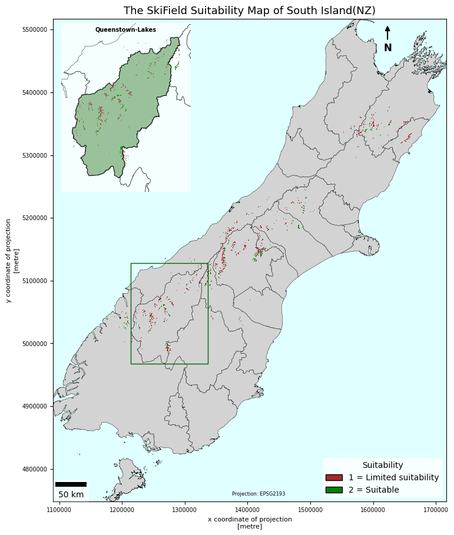
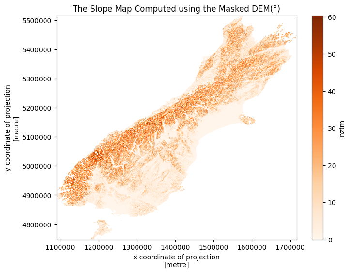
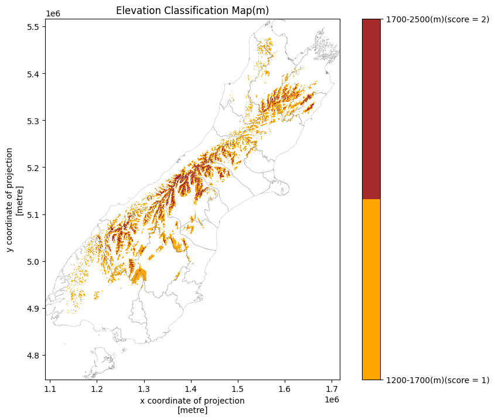
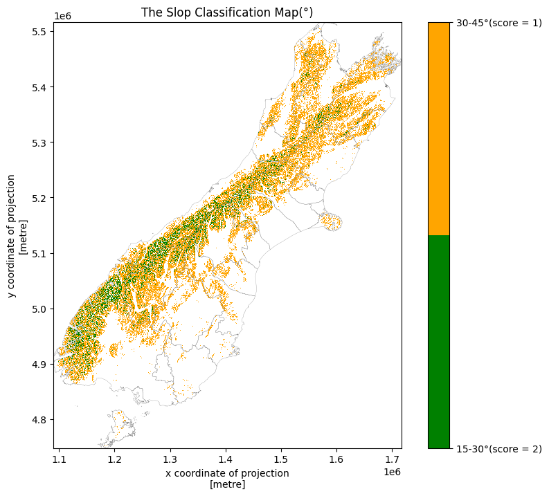
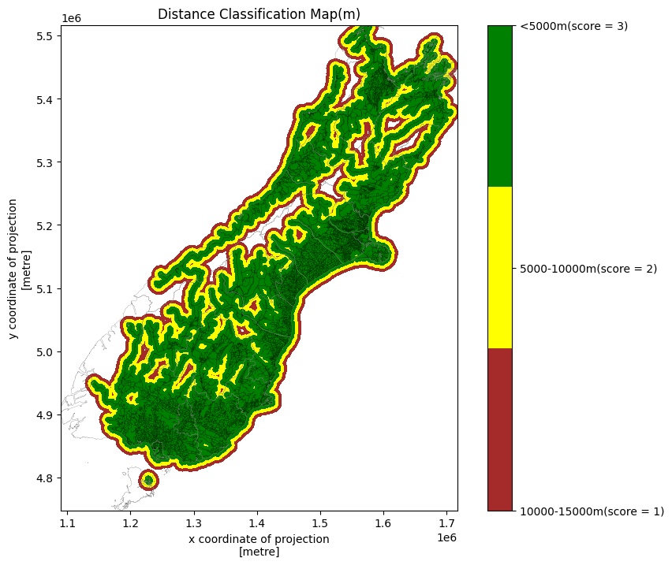

# Ski Field Suitability Modelling — South Island, New Zealand

## Final Output



*Saved coursework output showing limited-suitability and suitable areas, with a detailed Queenstown-Lakes inset. This map reflects the original notebook; see the validation note below before interpreting it as a final analytical result.*

A Python-based multi-criteria spatial analysis exploring potential ski-field suitability across New Zealand’s South Island. Completed as coursework at the **University of Canterbury**, this project demonstrates terrain analysis, raster processing, spatial modelling, zonal statistics and cartographic visualisation.

## Overview

The workflow combines elevation, slope and road proximity to screen candidate areas using coursework-defined criteria. Reclassified rasters are multiplied using map algebra, summarised by territorial authority and presented in a thematic map.

## Data

| Dataset | Purpose |
|---|---|
| `dem_300m.tif` | 300 m DEM for elevation and slope analysis |
| `TA_south.gpkg` | Territorial authority boundaries for clipping and zonal summaries |
| `road_centrelines_south.gpkg` | Road centrelines for proximity analysis |

The analysis uses **NZTM2000 (EPSG:2193)**. Input datasets were supplied for the coursework and are required to rerun the notebook.

## Methodology

### 1. Data preparation and terrain analysis

Loaded raster and vector datasets, checked coordinate-system consistency and clipped the DEM using South Island territorial authority boundaries. Derived slope in degrees from the clipped DEM.



### 2. Elevation reclassification

Assigned scores to elevation ranges and excluded values outside the selected range.

| Elevation | Score |
|---|---:|
| >1,200–1,700 m | 1 |
| >1,700–2,500 m | 2 |
| Outside these ranges | Excluded |



### 3. Slope reclassification

Applied the prescribed slope thresholds, favouring the gentler of the two retained ranges.

| Slope | Score |
|---|---:|
| >15–30° | 2 |
| >30–45° | 1 |
| Outside these ranges | Excluded |



### 4. Road proximity

Rasterised road centrelines to the DEM grid and calculated straight-line distance to roads. Assigned higher scores to locations closer to roads.

| Road distance | Score |
|---|---:|
| ≤5 km | 3 |
| >5–10 km | 2 |
| >10–15 km | 1 |
| >15 km | Excluded |



### 5. Multi-criteria suitability modelling

Combined the three reclassified rasters using a multiplicative model:

```text
Suitability score = Elevation score × Slope score × Road-proximity score
```

The coursework specifies the following final classification:

| Combined score | Classification |
|---|---|
| <6 | Excluded |
| 6–9 | Limited suitability |
| >9 | Suitable |

This is a rule-based multi-criteria model, not a weighted overlay.

### 6. Regional summaries and mapping

Used zonal statistics to summarise suitability classes by territorial authority and calculate the area retained in both classes. Produced the map shown above with territorial authority boundaries, a Queenstown-Lakes inset, a legend, a scale bar and a north arrow.

## Tools

**Language:** Python

**Libraries:** GeoPandas, NumPy, pandas, Rasterio, rioxarray, xarray-spatial, geocube, rasterstats, Matplotlib and matplotlib-scalebar.

**Methods:** Raster clipping, slope analysis, rasterisation, proximity analysis, reclassification, map algebra, zonal statistics and thematic mapping.

## Notebook and Reproduction

[Open the analysis notebook](59612505_WenjuanWang_Assignment3.ipynb)

The notebook contains processing steps, explanatory notes and saved outputs. To rerun it:

1. Install the required Python libraries.
2. Obtain the three course-supplied input datasets with appropriate permissions.
3. Place the datasets in the notebook’s working directory or update the input paths.
4. Address the validation issue below and run the cells in order.

The images in this repository were extracted from the notebook’s saved outputs; the analysis has not been rerun for this README.

## Interpretation and Limitations

This is an **educational regional screening exercise**, not a development recommendation or council planning assessment.

- The 300 m DEM supports broad screening rather than detailed site design.
- Road proximity represents straight-line distance, not driving distance, travel time or terrain-adjusted access.
- Thresholds were prescribed by the coursework rather than independently calibrated.
- Snow reliability, avalanche risk, land ownership, planning permissions, environmental protections and infrastructure capacity are not modelled.
- A suitable classification means a location meets the model’s selected criteria; it does not establish development feasibility.

### Validation note

The original notebook uses `> 6` for the lower boundary of the limited-suitability class, excluding cells scoring exactly 6. The coursework specifies `>= 6`. The map at the top reflects this original implementation.

This condition needs correction and downstream maps and statistics must be regenerated before reporting final candidate-area totals or territorial authority rankings. Numerical results are therefore not reproduced here.

## Data Attribution

Input filenames are recorded above, but original dataset providers and licences have not been verified for this repository. Refer to the course-supplied metadata and applicable permissions before redistributing source data. The source datasets are not included in this package.
